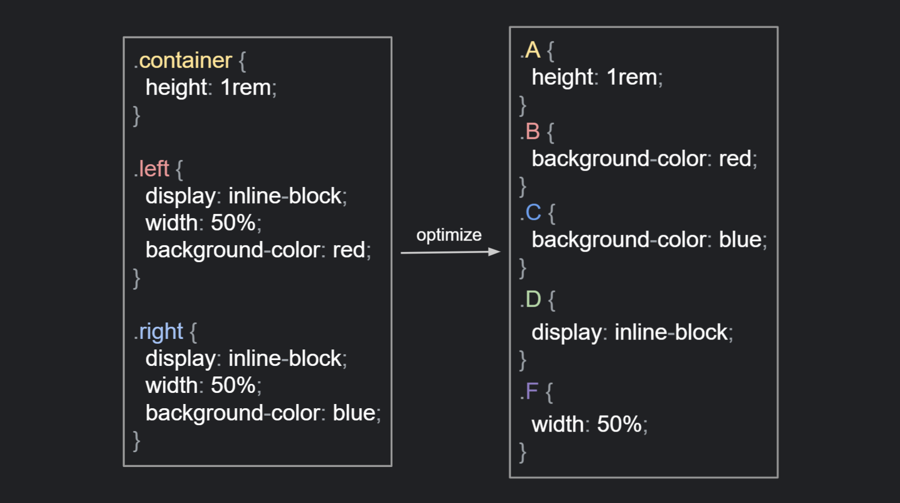

# Next Atomic CSS

Next.js plugin for optimizing css.  
This plugin will mangle your css in production mode.


## How to use

### Installation

```
npm install next-atomic-css
```

### Configuration

Note that you need to divide settings according to whether client or server.  
If you not divide, some options may cause errors.

```javascript
// next.config.js

const withAtomicCss = require("next-atomic-css");

module.exports = withAtomicCss({
  cssOptions: {
    // https://github.com/webpack-contrib/css-loader#options
  },
  sassOptions: {
    // https://github.com/webpack-contrib/sass-loader#options
  },
});
```

## Next Plan

Now I'm considering how to split css atomically.  
If you have a good idea, please contact to me :)


